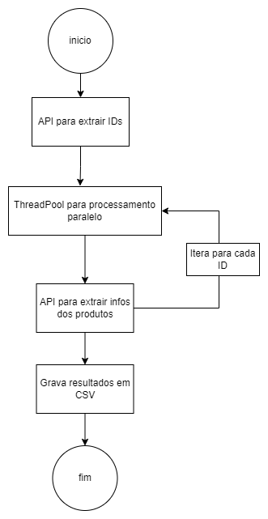

# Challenge Engineer - Segunda Parte - SQL

Projeto desenvolvido para a primeira parte do desafio do Mercado Livre.

O fluxo abaixo foi construído com o objetivo final de extrair informações de produtos do mercado livre por meio de sua API.

A função **get_ids** tem como objetivo extrair os ids dos produtos de acordo com o termo de busca. Essa função retorna uma lista com todos os ids consultados.

Após isso, a função **get_info** extrai as informações relevantes do produto de acordo com o id passado. Essa função utiliza uma outra função, definida previamente, para extair as informações relevantes dos campos de estrutura, ou dicionários.

Esse processo é executado em paralelo, com o objetivo de melhorar a performance da solução. Com esse objetivo, é utilizado a função **ThreadPoolExecutor**. Durante os testes foi possível notar uma redução de 20 segundos para 5 segundos no tempo de execução dessa etapa, para 50 itens.

A função **write_to_csv** foi definida com o objetivo de gravar apenas os dados novos no csv existente. Sendo assim é possível manter um histórico das informações.

Por fim, essa solução é executada para os termos de busca ['chromecast', 'Google Home', 'Apple TV', 'Amazon Fire TV'].

Para futuras evoluções, sugiro:

- Utilização de um banco de dados para armazenamento do histórico;

- Aumento da utilização de paralelismo para melhora de performance;

- Implementação de tratamentos de erros, principalmente no retorno das APIs e na validação do conteúdo obtido para cada item;

- Tratamentos avançados nos dados com o objetivo de facilitar as análises e diminuir o custo de armazenamento. Por exemplo, armonização de campos como ram_memory, storage_capacity e warranty_time.